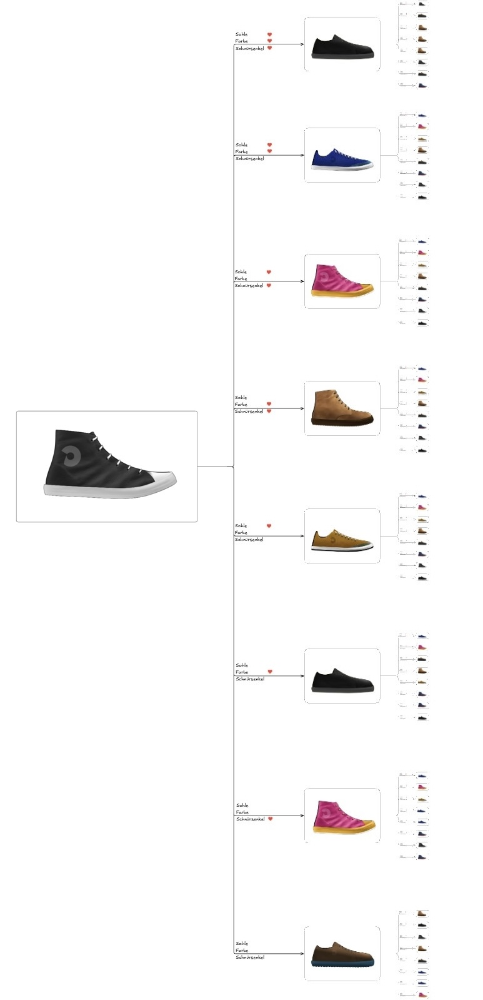

# Sneaker Swipe App (Tinder-for-Sneakers)

A web-based sneaker discovery app that allows users to explore a collection of sneaker designs in a Tinder-like swipe experience.

Users can:

- Swipe vertically through sneaker cards and view each design in detail.
- Like specific shoe components, such as the sole, color, or laces, using interactive heart buttons that change color on click.
- Bookmark favorite sneakers with a single click; bookmarks are saved in the browser's local storage for quick reference.
- Toggle detailed descriptions using a “mehr” button to reveal additional product information.
- Automatically receive new sneaker recommendations as they scroll to the next card.

---

## 🚀 **Features**

* **Dynamic sneaker data from SQLite (`sneakers.db`)**
* **FastAPI backend** with API endpoints:

  * `/shoes` — Get all sneakers
  * `/shoe/{id}` — Get details for a specific sneaker
  * `/recommend` — Get recommended next sneaker (currently random)
* **Frontend** with:

  * Swipe-like scrollable interface
  * Like buttons (sole, color, laces) with heart icon toggle
  * Bookmark button (saved in localStorage)
  * "More" button to toggle description
  * Auto-loads a new sneaker on scroll
* **YOLO + CLIP** used for shoe part detection and embedding generation
* Images and icons served from `/static/`

---

## 📂 **Project structure**

```

TINDER-FOR-SNEAKERS/
├── recommender/                        # Recommendation logic (Annoy index + helper scripts)
│   ├── indices/                        # Saved Annoy index files
│   ├── create\_annoy.py                 # Script to build Annoy index from embeddings
│   └── recommender.py                  # Logic for finding similar sneakers
├── UI-DB/                              # App frontend + FastAPI backend
│   ├── static/                         # Frontend assets
│   │   ├── icons/                      # Icons (heart, bookmark)
│   │   │   ├── heart-white.png
│   │   │   ├── heart-red.png
│   │   │   ├── bookmark.png
│   │   │   ├── bookmark\_filled.png
│   │   │   └── website.png
│   │   ├── Shoes/                      # Sneaker image files
│   │   ├── metadata.json               # Metadata for initial DB fill (name, colors, etc.)
│   │   ├── script.js                   # JS logic for rendering, scroll, likes, bookmarks
│   │   └── style.css                   # CSS for app design (mobile-style, snap scroll, etc.)
│   ├── templates/
│   │   └── index.html                  # Main HTML template with app layout
│   ├── init\_db.py                      # Script to create & populate SQLite DB with embeddings
│   ├── main.py                         # FastAPI app with API routes and static file serving
│   └── sneakers.db                     # Generated SQLite database storing sneaker data
├── YOLO/                               # YOLO part detection scripts & config
│   ├── anns/                           # YOLO annotations for training/testing
│   ├── models/                         # YOLO model files (weights, configs)
│   └── yolo\_utils.py                   # Helper functions for YOLO processing
├── .gitignore                          # Git ignore rules
├── README.md                           # This documentation file
└── requirements.txt                    # Python dependencies (FastAPI, Uvicorn, etc.)

```

---

## ⚡ **How to run**

1. Install dependencies:

```bash
pip install -r requirements.txt
```

2. (Optional) Initialize DB (only if you want to recreate it):

```bash
cd UI-DB
python init_db.py
```

3. Start the server:

```bash
uvicorn main:app --reload
```

4. Open your browser:

```
http://127.0.0.1:8000
```

---

## 🛠 **Tech stack**

* **Backend:** FastAPI, SQLite
* **Frontend:** HTML, CSS, Vanilla JS
* **AI:** YOLO (for part detection), CLIP (for embeddings)
* **Recommendation:** Annoy index (planned / partial)

---

## 🌳 **Decision Tree (Recommendation Logic Concept)**

The following image illustrates a **conceptual decision tree** for sneaker recommendations based on **component-level user preferences**.

In the current app, users can like individual parts of a sneaker (such as the **sole**, **color**, or **laces**) using interactive heart icons. This tree visualizes how those preferences might be translated into a structured decision-making process to deliver **personalized sneaker recommendations**.


### 🧠 What the Decision Tree Represents

* Each branching point represents a **user preference** for a sneaker component (e.g., a specific sole color or lace style).
* The tree simulates a **step-by-step filtering process**, where sneakers are narrowed down based on component matches with previously liked designs.
* Similarity can be calculated via embeddings (e.g., CLIP vectors), but filtered based on what the user has liked most often (e.g., always black soles, or bright colors).

This logic could evolve into a **rule-based or hybrid recommender** system that prioritizes certain sneaker features over others based on user behavior.

> ⚠️ **Note:** This is a **conceptual visualization only**. The actual implementation of this decision tree logic has not yet been developed. Currently, sneaker recommendations are random or based on general image similarity.



### 💡 Future Potential

* Use this structure to **weight different sneaker parts** in the similarity score (e.g., give more importance to soles if the user clicks on soles often).
* Incorporate a **user history** to refine the recommendation path over time.
* Build an **explainable recommendation engine**, where users understand *why* a sneaker was suggested (e.g., “Because you liked yellow soles and pink uppers”).

---

## 🌱 **Next steps / ideas**

* Refine and tune similarity search (e.g. weighting components differently, smarter exploration strategies)
* Add persistent user accounts for bookmarks and personalized preferences
* Deploy to cloud (e.g. PythonAnywhere, Vercel, or AWS) for public access
* Add admin interface or API for uploading new sneaker data and regenerating indices

---